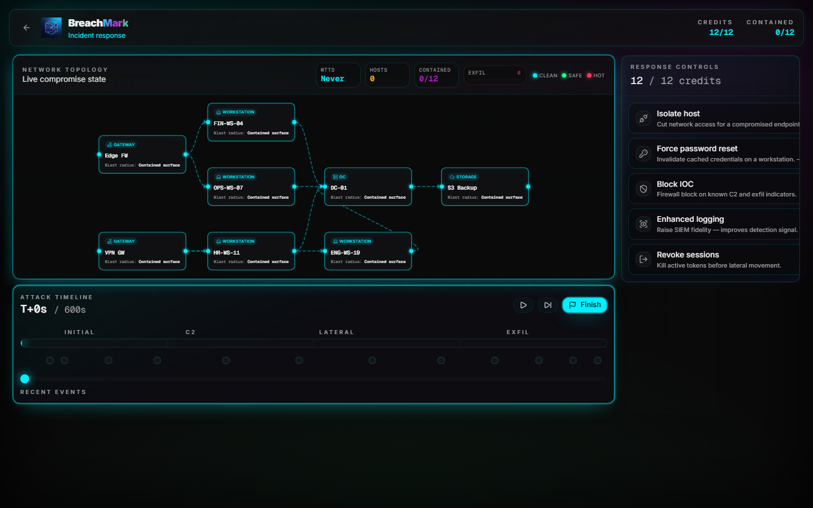
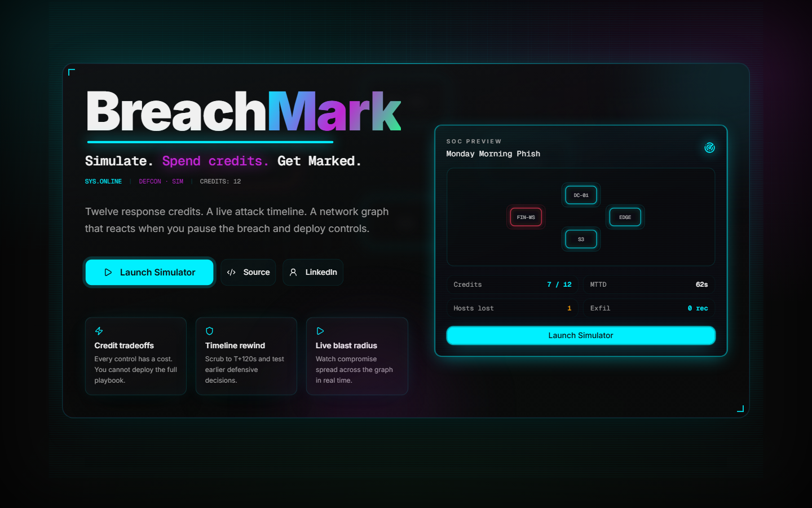
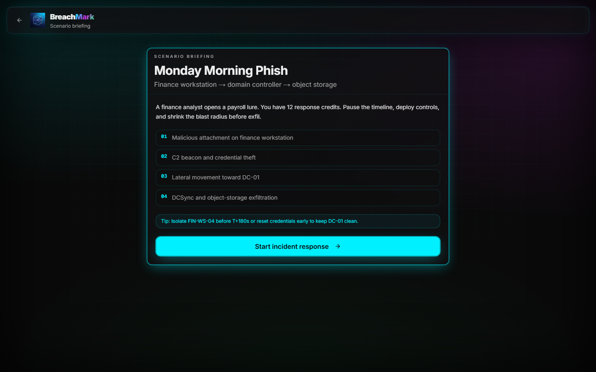
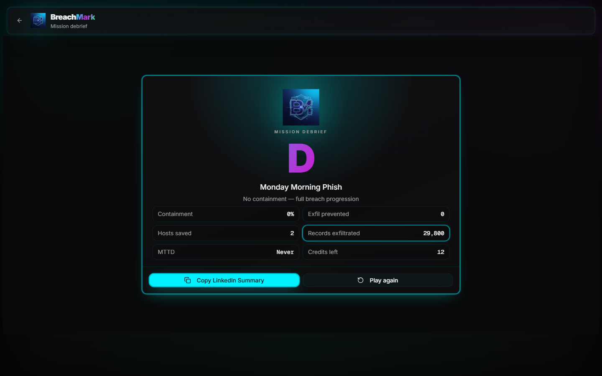
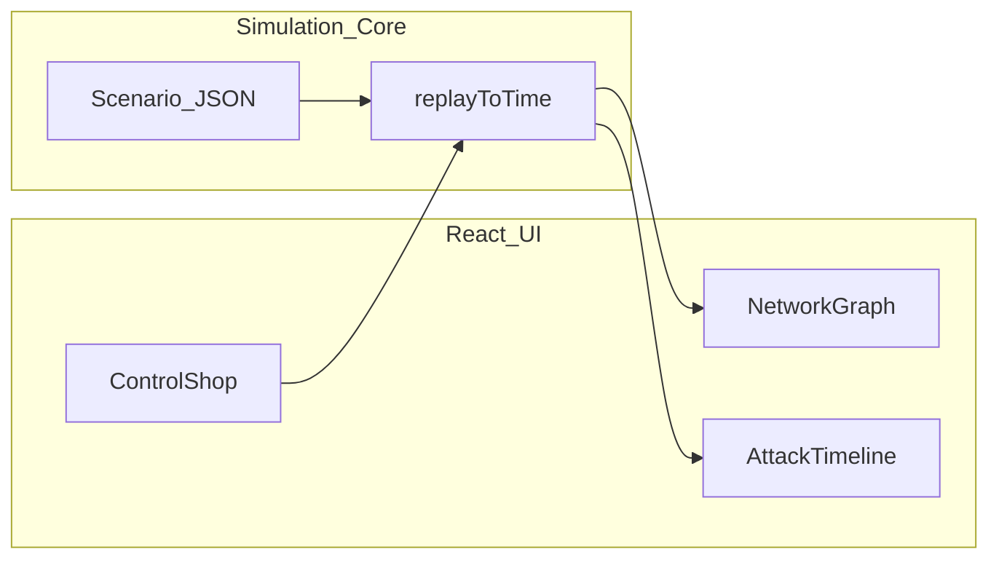

<div align="center">

# BreachMark

### Cyber SOC command center simulator

**Spend limited response credits. Contain two attack paths. Watch the blast radius change on a live network graph.**

<br />

[](https://breachmark.vercel.app)
[](https://github.com/FratresMedAI/BreachMark/actions/workflows/ci.yml)

<br />



<br />

<sub>
Next.js 16 · TypeScript · Tailwind CSS v4 · shadcn/ui · React Flow · Framer Motion · Vitest · Vercel
</sub>

[Live demo](https://breachmark.vercel.app) · [Scenario design](SCENARIO_DESIGN.md) · [Report issue](https://github.com/FratresMedAI/BreachMark/issues)

</div>

---

## At a glance

| | |
|---|---|
| **Problem** | Security training is often static—checklists and slides don't show *tradeoffs under pressure*. |
| **Solution** | A premium cyber SOC command center where every defensive control costs credits and one containment does not end the incident. |
| **Audience** | Recruiters, hiring managers, and blue-team learners who want a **two-minute** interactive proof of skill. |
| **Status** | v1.3 — Series-A visual reset, neon glassmorphism UI, one polished scenario (*Monday Morning Phish*), full play loop, shareable scorecard. |

> **Hook:** You get **15 response credits**. Two gateways light up at T+30 and T+45. Pause the timeline, try controls, and watch the blast radius change.

---

## Why this exists (portfolio narrative)

I built **BreachMark** to demonstrate skills that don't show up in a resume bullet list:

- **Defensive thinking** — prioritizing controls when you cannot afford them all  
- **Systems design** — simulation engine decoupled from UI for testable, deterministic replay  
- **Product sense** — recruiter can go from README → live demo → scorecard in under two minutes  

This repo is meant to be **pinned on GitHub** and linked from a resume or LinkedIn as a show-don't-tell project.

---

## Features

| Feature | Recruiter signal | Implementation |
|---------|------------------|----------------|
| **Credit budget** | Prioritization under pressure | Reset creds (4cr), block IOC (4cr), logging (3cr), revoke sessions (5cr) |
| **Blast-radius graph** | Systems thinking | React Flow topology with compromise levels, dual gateway ingress, active breach glow, and click-to-target controls |
| **Attack timeline** | Incident sequencing | Segmented rail, keyboard shortcuts (`Space` / `→` / `F`), deterministic replay from T+0 |
| **Scorecard** | Shareable outcome | Animated letter grade, confetti on **A**, LinkedIn-ready copy |
| **Safe demo data** | Responsible security tooling | Fictional scenario data only; no scanning, no real telemetry |

---

## Quick start (recruiter path)

1. Open the **[live demo](https://breachmark.vercel.app)** (no install).  
2. **Launch Simulator** → **Start incident response** inside the cyber SOC command center.  
3. Try **Block IOC** before **T+30**, then **Revoke sessions** before **T+45** if the VPN path is still moving.  
4. Scrub the glowing timeline → **Finish** → **Copy LinkedIn Summary**.

**Goal to explore:** DC stays clean and exfil stays at **0** when you cover both ingress paths—scrub the timeline to see why.

---

## Screenshots



<br />



<br />



<p align="center"><sub>README screenshots are captured from the running BreachMark UI and kept in <code>public/screenshots/</code>. For the real interaction model, use the <a href="https://breachmark.vercel.app">live demo</a>.</sub></p>

---

## Tech stack

| Layer | Technology | Role |
|-------|------------|------|
| Framework | Next.js 16 (App Router) | SSR-ready shell, Vercel deploy |
| Language | TypeScript (strict) | End-to-end typing |
| UI | shadcn/ui + Tailwind CSS v4 | Accessible components, dark “SOC radar” theme |
| Graph | `@xyflow/react` | Interactive compromise topology |
| Motion | Framer Motion | Landing and scorecard transitions |
| State | Zustand | Game phase, controls, replay sync |
| Tests | Vitest | Simulation engine unit tests |
| CI | GitHub Actions | `test` · `lint` · `build` on every push |

---

## Architecture



```
src/
├── lib/simulation/     # Pure TS engine (no React) — Vitest covered
├── data/scenarios/     # Attack timelines + MITRE-style events
├── components/game/    # Graph, timeline, controls, scorecard
└── store/              # Zustand game state
```

Design details: [SCENARIO_DESIGN.md](SCENARIO_DESIGN.md)

---

## Local development

```bash
git clone https://github.com/FratresMedAI/BreachMark.git
cd BreachMark
npm install
npm run dev
```

| Command | Description |
|---------|-------------|
| `npm run dev` | Start dev server at http://localhost:3000 |
| `npm test` | Run simulation engine tests |
| `npm run lint` | ESLint |
| `npm run build` | Production build |

---

## What I learned

- **Reachability matters** — events cannot fire from hosts that were never compromised; without that rule, defensive actions feel meaningless.  
- **Deterministic replay** — scrubbing time only works if state is recomputed from T+0 with the same inputs.  
- **Recruiters need speed** — interactivity beats documentation when the goal is a first impression.

---

## Deploy your own

[](https://vercel.com/new/clone?repository-url=https://github.com/FratresMedAI/BreachMark&project-name=breach-mark&repository-name=BreachMark)

Set `NEXT_PUBLIC_SITE_URL` to your deployment URL for correct Open Graph links.

---

## Author

**[Kyle Bean](https://www.linkedin.com/in/kyle-bean-fratresxai/)** — interactive security tooling and full-stack portfolio projects.

| | |
|---|---|
| LinkedIn | [linkedin.com/in/kyle-bean-fratresxai](https://www.linkedin.com/in/kyle-bean-fratresxai/) |
| GitHub | [@FratresMedAI](https://github.com/FratresMedAI) |
| Repo | [FratresMedAI/BreachMark](https://github.com/FratresMedAI/BreachMark) |

If this project is useful on a resume or interview loop, consider **starring the repo** — it helps visibility on GitHub.

---

## License

[MIT](LICENSE) — fictional scenario data only; no real systems are scanned.
