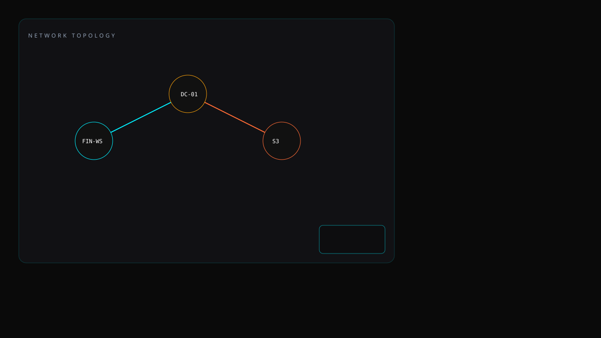
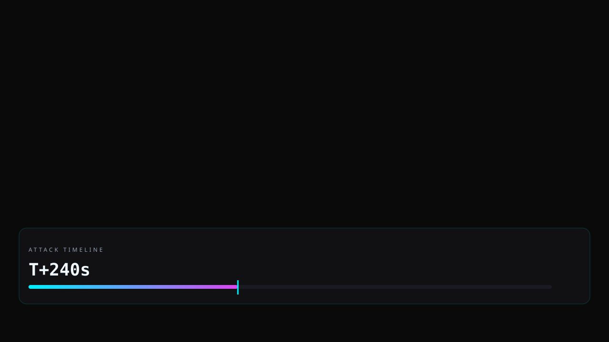
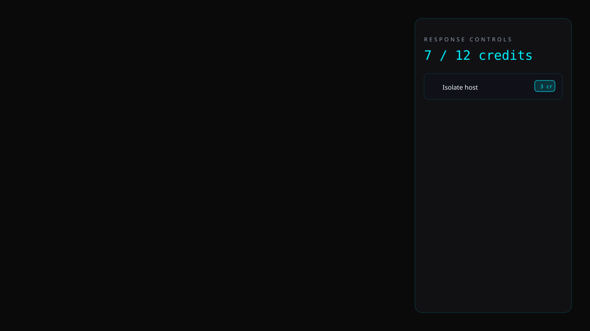
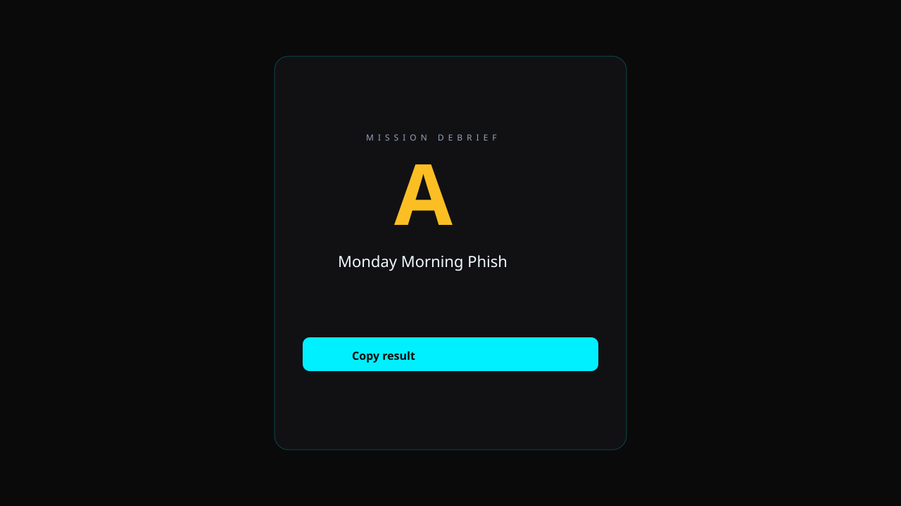
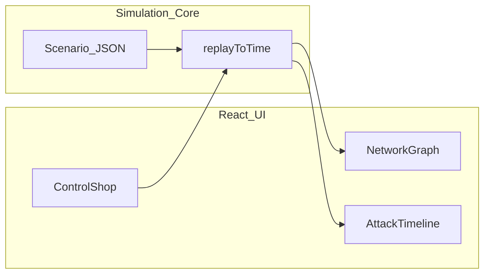

<div align="center">

# BreachMark

### Interactive blue-team incident simulator

**Spend limited response credits. Scrub the attack timeline. Watch the blast radius change on a live network graph.**

<br />

[](https://breachmark.vercel.app)
[](https://github.com/FratresMedAI/BreachMark/actions/workflows/ci.yml)
[](LICENSE)

[](https://breachmark.vercel.app)
[](https://nextjs.org)
[](https://www.typescriptlang.org/)
[](https://ui.shadcn.com/)
[](https://reactflow.dev/)
[](https://vitest.dev/)

<br />


<br />

[Live demo](https://breachmark.vercel.app) · [Scenario design](SCENARIO_DESIGN.md) · [Report issue](https://github.com/FratresMedAI/BreachMark/issues)

</div>

---

## At a glance

| | |
|---|---|
| **Problem** | Security training is often static—checklists and slides don't show *tradeoffs under pressure*. |
| **Solution** | A playable incident where every defensive control costs credits and the timeline rewinds deterministically. |
| **Audience** | Recruiters, hiring managers, and blue-team learners who want a **60-second** interactive proof of skill. |
| **Status** | v1.2 — Cyber SOC dashboard UI, one polished scenario (*Monday Morning Phish*), full play loop, shareable scorecard. |

> **Hook:** You get **12 response credits**. The attack keeps moving. Pause the timeline, spend credits, watch the blast radius shrink or spread.

---

## Why this exists (portfolio narrative)

I built **BreachMark** to demonstrate skills that don't show up in a resume bullet list:

- **Defensive thinking** — prioritizing controls when you cannot afford them all  
- **Systems design** — simulation engine decoupled from UI for testable, deterministic replay  
- **Product sense** — recruiter can go from README → live demo → scorecard in under two minutes  

This repo is meant to be **pinned on GitHub** and linked from a resume or LinkedIn as a show-don't-tell project.

---

## Features

| Feature | What it shows |
|---------|----------------|
| 💳 **Credit budget** | Isolate (3cr), reset creds (2cr), block IOC (2cr), logging (2cr), revoke sessions (3cr), awareness (1cr) |
| 🕸️ **Network graph** | React Flow map with glow nodes, MiniMap, compromise levels, click-to-target controls |
| ⏱️ **Timeline scrubber** | Video-editor rail, keyboard shortcuts (`Space` / `→` / `F`), deterministic replay from T+0 |
| 📊 **Scorecard** | Animated letter grade, confetti on **A**, [LinkedIn-ready copy](https://breachmark.vercel.app) |
| 🔒 **Fictional data only** | No scanning, no real telemetry—safe to demo anywhere |

---

## Quick start (recruiter path)

1. Open the **[live demo](https://breachmark.vercel.app)** (no install).  
2. **Launch Simulator** → **Start incident response**.  
3. Deploy **Isolate host** on `FIN-WS-04` before **T+180s** (or **Force password reset** on finance).  
4. Scrub the timeline → **Finish** → **Copy result**.

**Win condition to try:** DC stays clean and exfil stays at **0** when finance is isolated early.

---

## Screenshots

| Landing | Network graph |
|:---:|:---:|
|  |  |

| Timeline | Control shop | Scorecard |
|:---:|:---:|:---:|
|  |  |  |

<p align="center"><sub>Hero GIF coming soon — record a ~12s gameplay loop to <code>/public/demo.gif</code> and embed at the top of this section.</sub></p>

---

## Tech stack

| Layer | Technology | Role |
|-------|------------|------|
| Framework | Next.js 16 (App Router) | SSR-ready shell, Vercel deploy |
| Language | TypeScript (strict) | End-to-end typing |
| UI | shadcn/ui + Tailwind CSS v4 | Accessible components, dark “SOC radar” theme |
| Graph | `@xyflow/react` | Interactive compromise topology |
| Motion | Framer Motion | Landing and scorecard transitions |
| State | Zustand | Game phase, controls, replay sync |
| Tests | Vitest | Simulation engine unit tests |
| CI | GitHub Actions | `test` · `lint` · `build` on every push |

---

## Architecture



```
src/
├── lib/simulation/     # Pure TS engine (no React) — Vitest covered
├── data/scenarios/     # Attack timelines + MITRE-style events
├── components/game/    # Graph, timeline, controls, scorecard
└── store/              # Zustand game state
```

Design details: [SCENARIO_DESIGN.md](SCENARIO_DESIGN.md)

---

## Local development

```bash
git clone https://github.com/FratresMedAI/BreachMark.git
cd BreachMark
npm install
npm run dev
```

| Command | Description |
|---------|-------------|
| `npm run dev` | Start dev server at http://localhost:3000 |
| `npm test` | Run simulation engine tests |
| `npm run lint` | ESLint |
| `npm run build` | Production build |

---

## What I learned

- **Reachability matters** — events cannot fire from hosts that were never compromised; without that rule, defensive actions feel meaningless.  
- **Deterministic replay** — scrubbing time only works if state is recomputed from T+0 with the same inputs.  
- **Recruiters need speed** — interactivity beats documentation when the goal is a first impression.

---

## Deploy your own

[](https://vercel.com/new/clone?repository-url=https://github.com/FratresMedAI/BreachMark&project-name=breach-mark&repository-name=BreachMark)

Set `NEXT_PUBLIC_SITE_URL` to your deployment URL for correct Open Graph links.

---

## Author

**[Kyle Bean](https://www.linkedin.com/in/kyle-bean-fratresxai/)** — interactive security tooling and full-stack portfolio projects.

| | |
|---|---|
| LinkedIn | [linkedin.com/in/kyle-bean-fratresxai](https://www.linkedin.com/in/kyle-bean-fratresxai/) |
| GitHub | [@FratresMedAI](https://github.com/FratresMedAI) |
| Repo | [FratresMedAI/BreachMark](https://github.com/FratresMedAI/BreachMark) |

If this project is useful on a resume or interview loop, consider **starring the repo** — it helps visibility on GitHub.

---

## License

[MIT](LICENSE) — fictional scenario data only; no real systems are scanned.
